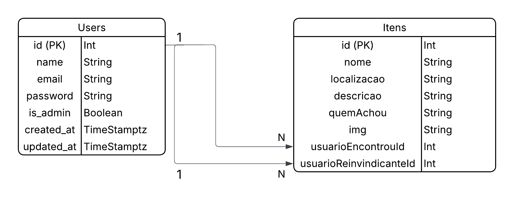

# IFounds


## 📌 Descricao

O **IFounds** e um sistema web desenvolvido em **Laravel** para cadastro, consulta e reivindicacao de itens perdidos. A aplicacao permite que usuarios autenticados publiquem itens encontrados, visualizem detalhes dos objetos cadastrados e reivindiquem um item quando ele pertencer a eles.

O projeto tambem possui uma area administrativa para gerenciamento dos itens cadastrados e promocao de usuarios a administradores.

## ✨ Funcionalidades principais

- Cadastro de usuarios.
- Login e logout com autenticacao do Laravel.
- Primeiro usuario cadastrado e promovido automaticamente a administrador.
- Listagem de itens perdidos.
- Cadastro de novo item encontrado com imagem, nome, localizacao e descricao.
- Pagina de detalhes do item.
- Reivindicacao de item por usuario autenticado.
- Pagina de perfil com itens publicados pelo usuario logado.
- Painel administrativo protegido por middleware.
- Edicao e exclusao de itens pelo administrador.
- Listagem de usuarios no painel administrativo.
- Promocao de usuarios comuns para administradores.
- Upload de imagens no disco `public` do Laravel.

## 🧰 Tecnologias utilizadas

- **PHP 8.3+**
- **Laravel 13**
- **Blade Templates**
- **Laravel Auth / Sessions**
- **Eloquent ORM**
- **PostgreSQL** configurado no `.env.example`
- **Vite 8** *(opcional, para desenvolvimento/build de assets)*
- **Tailwind CSS 4** *(opcional, para desenvolvimento/build de assets)*
- **Bootstrap** via CDN nas views
- **Composer**
- **NPM** *(opcional, apenas se for usar o Vite)*

## 🗄️ Banco de dados

O sistema utiliza as tabelas padrao do Laravel para usuarios, cache, jobs e sessoes, alem da tabela principal `itens`.

### Diagrama ER

Voce pode manter o diagrama em Mermaid abaixo e tambem adicionar uma imagem exportada do diagrama neste caminho:



### Tabelas relevantes

| Tabela | Descricao |
| --- | --- |
| `users` | Armazena usuarios cadastrados e o campo `is_admin` para permissao administrativa. |
| `itens` | Armazena os itens perdidos/encontrados cadastrados na plataforma. |
| `sessions` | Armazena sessoes de usuarios, conforme configuracao do Laravel. |
| `cache` / `cache_locks` | Tabelas de cache da aplicacao. |
| `jobs` / `job_batches` / `failed_jobs` | Estrutura de filas do Laravel. |
| `password_reset_tokens` | Tokens para recuperacao de senha, gerado pela migration padrao. |

> Observacao: existe uma migration chamada `2026_05_25_213005_truncate_itens.php` que limpa a tabela `itens` ao ser executada. Use migrations em ambientes com dados reais com cuidado.

## ✅ Pre-requisitos

Antes de iniciar, tenha instalado:

- PHP **8.3 ou superior**
- Composer
- PostgreSQL
- Git

Opcionalmente, instale **Node.js e NPM** caso queira rodar o Vite, recompilar assets ou usar os scripts de frontend definidos em `package.json`.

Tambem e necessario ter as extensoes PHP exigidas pelo Laravel habilitadas, como `pdo`, `mbstring`, `openssl`, `tokenizer`, `xml`, `ctype`, `json` e a extensao do banco utilizado, por exemplo `pdo_pgsql`.

## ⚙️ Instalacao e configuracao

1. Clone o repositorio:

```bash
git clone <url-do-repositorio>
cd ifoundsLaravel
```

2. Instale as dependencias PHP:

```bash
composer install
```

3. Se for usar o Vite ou alterar assets de frontend, instale as dependencias JavaScript:

```bash
npm install
```

> Se a aplicacao ja estiver rodando corretamente apenas com `php artisan serve`, este passo pode ser ignorado.

4. Crie o arquivo de ambiente:

```bash
cp .env.example .env
```

No Windows PowerShell, use:

```powershell
Copy-Item .env.example .env
```

5. Gere a chave da aplicacao:

```bash
php artisan key:generate
```

6. Configure o banco no arquivo `.env`:

```env
APP_NAME=IFounds
APP_URL=http://localhost:8000

DB_CONNECTION=pgsql
DB_HOST=localhost
DB_PORT=5432
DB_DATABASE=ifounds
DB_USERNAME=postgres
DB_PASSWORD=sua_senha
```

7. Crie o link simbolico para arquivos enviados:

```bash
php artisan storage:link
```

Esse passo e importante porque as imagens dos itens sao salvas em `storage/app/public` e exibidas pela aplicacao a partir de `/storage`.

## 🧬 Como rodar as migrations

Execute as migrations:

```bash
php artisan migrate
```

> Em ambiente de desenvolvimento, se precisar recriar tudo do zero, use `php artisan migrate:fresh --seed`. Esse comando apaga os dados existentes.

## ▶️ Como rodar o projeto

Inicie o servidor Laravel:

```bash
php artisan serve
```

Se estiver usando Vite para desenvolvimento de assets, em outro terminal execute:

```bash
npm run dev
```

Acesse:

```text
http://127.0.0.1:8000
```

Tambem existe um script Composer para ambiente de desenvolvimento:

```bash
composer run dev
```

Esse script inicia servidor Laravel, fila, logs e Vite em paralelo. Por isso, ele exige Node.js/NPM instalado. Caso nao tenha NPM, use apenas `php artisan serve`.

## 🧭 Rotas disponiveis

### Rotas publicas

| Metodo | Rota | Controller | Descricao |
| --- | --- | --- | --- |
| `GET` | `/` | `LoginPaginaController@index` | Exibe a tela de login ou redireciona usuario autenticado. |
| `POST` | `/registrar` | `LoginPaginaController@register` | Cadastra novo usuario. |
| `POST` | `/login` | `LoginPaginaController@login` | Autentica usuario. |
| `GET` | `/logout` | `LoginPaginaController@logout` | Encerra sessao do usuario. |

### Rotas autenticadas

Essas rotas usam o middleware `auth`.

| Metodo | Rota | Controller | Descricao |
| --- | --- | --- | --- |
| `GET` | `/itensperdidos` | `ItemPerdidoController@index` | Lista itens perdidos. |
| `POST` | `/itensperdidos/novo` | `ItemPerdidoController@store` | Cadastra novo item encontrado. |
| `GET` | `/item/{id}` | `ItemPaginaController@index` | Exibe detalhes de um item. |
| `POST` | `/item/{id}/reivindicar` | `ItemPaginaController@reivindicar` | Reivindica um item. |
| `GET` | `/perfil` | `PerfilController@index` | Exibe perfil e itens publicados pelo usuario. |

### Rotas administrativas

Essas rotas usam os middlewares `auth` e `admin`.

| Metodo | Rota | Controller | Descricao |
| --- | --- | --- | --- |
| `GET` | `/admin` | `AdministracaoController@index` | Exibe painel administrativo. |
| `POST` | `/admin/novo` | `AdministracaoController@store` | Cadastra item pela area administrativa. |
| `DELETE` | `/admin/deletar` | `AdministracaoController@destroy` | Remove um item. |
| `PUT` | `/admin/editar` | `AdministracaoController@update` | Atualiza dados de um item. |
| `POST` | `/admin/tornar-admin` | `AdministracaoController@tornarAdmin` | Promove usuario a administrador. |

## 📁 Estrutura de pastas relevante

```text
app/
+-- Http/
|   +-- Controllers/
|   |   +-- AdministracaoController.php
|   |   +-- ItemPerdidoController.php
|   |   +-- itemPaginaController.php
|   |   +-- LoginPaginaController.php
|   |   +-- PerfilController.php
|   +-- Middleware/
|       +-- CheckAdmin.php
+-- Models/
|   +-- Item.php
|   +-- User.php

database/
+-- migrations/
+-- seeders/
    +-- DatabaseSeeder.php
    +-- ItensSeeder.php

public/
+-- css/
+-- img/
+-- script/

resources/
+-- js/
+-- views/
    +-- Login/
    +-- components/
    +-- itens/

routes/
+-- web.php
+-- console.php
```

## 🔐 Regras de acesso

- Usuarios nao autenticados acessam apenas login, cadastro e autenticacao.
- Usuarios autenticados acessam listagem de itens, detalhes, reivindicacao e perfil.
- Administradores acessam o painel `/admin`.
- O primeiro usuario cadastrado no sistema recebe `is_admin = true` automaticamente.
- O middleware `CheckAdmin` bloqueia usuarios sem permissao administrativa com erro `403`.
